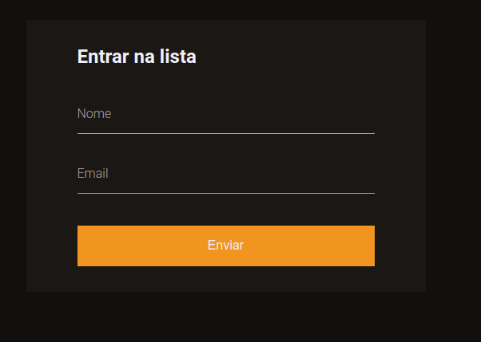
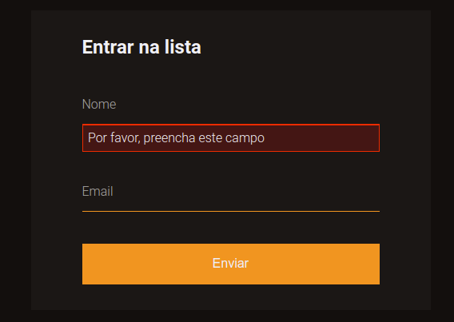

<h1 align="center">
 
  
 
 
Validação de forms customizada com HTML e JavaScript | Code/Drops #32
</h1>

Customizações com CSS e Javascript [ link ]( https://www.youtube.com/watch?v=GTMEuHxh8aQ )

  

    
    
  </a>

## Features
[//]: # (Add the features of your project here:)
This app features all the latest tools and practices in mobile development!
-  **HTML** - 
-  **CSS** - 
-  **Js** - 

## Getting started

- Clonar o repositório 
- Abrir em um browser 

## License

This project is licensed under the MIT License - see the [LICENSE](https://opensource.org/licenses/MIT) page for details.
